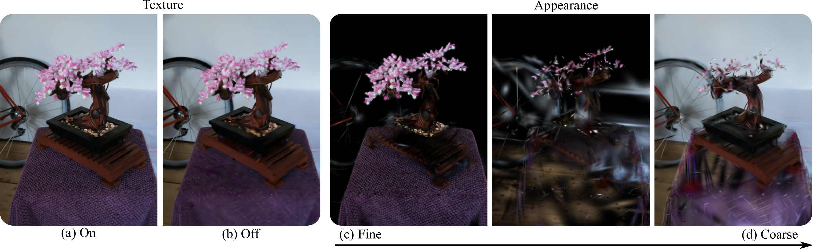

# Content-Aware Texturing for Gaussian Splatting
Panagiotis Papantonakis, Georgios Kopanas, Frédo Durand, George Drettakis<br>
| [Webpage](https://repo-sam.inria.fr/nerphys/gs-texturing/) | [Full Paper](https://repo-sam.inria.fr/nerphys/gs-texturing/ContentAwareTexturedGaussians-authors.pdf) || [Other GRAPHDECO Publications](http://www-sop.inria.fr/reves/publis/gdindex.php) | [NERPHYS project page](https://project.inria.fr/nerphys/) | <br>


This repository contains the code of the paper "Content-Aware Texturing for Gaussian Splatting", which can be found [here](https://repo-sam.inria.fr/nerphys/gs-texturing).
We also provide the configurations to train the models mentioned in the paper,
as well as the evaluation script that produces the results.

The project's code is based on the original 3DGS project that you can find [here](https://github.com/graphdeco-inria/gaussian-splatting).
Two main differences are that there has been a major refactoring of the `train.py` file that was aimed to increase readability and extensibility.

<a href="https://www.inria.fr/"> </a>
<a href="https://univ-cotedazur.eu/"> </a>
<a href="https://team.inria.fr/graphdeco/"> </a>

Abstract: *Gaussian Splatting has become the method of choice for 3D reconstruction and real-time rendering of captured real scenes. However, fine appearance details need to be represented as a large number of small Gaussian primitives, which can be wasteful when geometry and appearance exhibit different frequency characteristics. Inspired by the long tradition of texture mapping, we propose to use texture to represent detailed appearance where possible. Our main focus is to incorporate per-primitive texture maps that adapt to the scene in a principled manner during Gaussian Splatting optimization. We do this by proposing a new appearance representation for 2D Gaussian primitives with textures where the size of a texel is bounded by the image sampling frequency and adapted to the content of the input images. We achieve this by adaptively upscaling or downscaling the texture resolution during optimization. In addition, our approach enables control of the number of primitives during optimization based on texture resolution. We show that our approach performs favorably in image quality and total number of parameters used compared to alternative solutions for textured Gaussian primitives.*

<section class="section" id="BibTeX">
  <div class="container is-max-desktop content">
    <h2 class="title">BibTeX</h2>
    <pre><code>
@inproceedings{PapantonakisGSTexturing2025,
  booktitle = {Eurographics Symposium on Rendering},
  editor = {Wang, Beibei and Wilkie, Alexander},
  title = {{Content-Aware Texturing for Gaussian Splatting}},
  author = {Papantonakis, Panagiotis and Kopanas, Georgios and Durand, Frédo and Drettakis, George},
  year = {2025},
  publisher = {The Eurographics Association},
  ISSN = {1727-3463},
  ISBN = {978-3-03868-292-9},
  DOI = {10.2312/sr.20251190}
}
</code></pre>
</div>
</section>


## Funding and Acknowledgments

This work was funded by the European Research Council (ERC) Advanced Grant NERPHYS, number 101141721 [https://project.inria.fr/nerphys](https://project.inria.fr/nerphys). The authors are grateful to the OPAL infrastructure of the Université Côte d'Azur for providing resources and support, as well as Adobe and NVIDIA for software and hardware donations. This work was granted access to the HPC resources of IDRIS under the allocation AD011015561 made by GENCI. F. Durand acknowledges funding from Google, Amazon, and MIT-GIST.

## Installation

### Clone the repository
Make sure that submodules are also checkout out by adding the `--recursive` flag.

```shell
# SSH
git clone git@github.com:graphdeco-inria/gs-texturing.git --recursive
```
or
```shell
# HTTPS
git clone https://github.com/graphdeco-inria/gs-texturing --recursive
```

### Create and set up the environment
Create a conda environment with:
```shell
conda create -n gs_texturing python=3.12
conda activate gs_texturing
```

Run the installation script that should take care of everything
```shell
python install.py
```

At the end make sure that the torch has been installed with cuda support.

`python -c "import torch;print(torch.cuda.is_available())"`

should print `True`. If that's not the case the installation of the submodules might also fail.

## Training
You can train the model with default settings on any COLMAP dataset by running the following command.
```shell
python train.py -s <PATH TO COLMAP DATASET> -m <OUTPUT_DIR>
```

This work has introduced some new hyperparameters that may need to be tuned depending on the dataset and available system resources (e.g. memory). Below is a comprehensive list, with intuition on what the expected effect of each one is. A comparison is provided in **Appendix B** of the paper.
<details>
<summary>Newly Added Hyperparameters</summary>

```
--max_texture_resolution (default: 256)

Controls the maximum texture resolution for each individual primitive's texture. A higher value means that primitives can potentially carry more texels, becoming more expressive, at the cost of memory.

--adaptive_texelsize_percentile (default 0.9)

Controls how many primitives will be allowed to upscale and densify each densification cycle. A lower value means that more primitives will be potentially upscaled and densified, leading to a more aggressive behaviour, at the cost of higher peak memory usage.

--downscale_threshold (default 0.02)

Controls the threshold below which primitives get downscaled. A high value means more aggressive downscaling, which can lead to oversimplified textures and no splitting. A low value has the opposite effect which can increase the memory usage.

--lambda_texture_regul (default: 0.00000001)

Controls how strong the texture regulariser is. A low value will lead to textures that may train more quickly, but at the risk of overfitting, which will impede them from getting downscaled, leading to high memory usage. A high value has the opposite effect, with textures not being allowed to learn easily, leading to primitives with simpler textures.

--splitting_threshold (default: 32)

The smallest texture resolution threshold, that controls splitting. A low value means primitives split more easily, which can have the effect of spawning too many primitives, removing the need of textures. A high value has the opposite effect, with primitives needing more upscaling cycles to be split, if ever.
```

</details>

## Evaluation

The base model, along with all other models included in the paper can be trained using the `full_eval.py` script, that contains their exact configurations.
Note that there was an oversight regarding the texture regularisation while writing the paper that went unnoticed until the cleaning and release of the code.
In the paper, it is mentioned that the texture regularisation is an L1 loss.
In the code, however, this loss is actually weighted by the transmittance of the primitive (averaged over the pixels touched) for the specific view, which can range from 0 to 1.
The intuition behind it is that we want to regularise hidden primitives (contribution closer to 0) more, to save on memory and visible ones (contribution closer to 1) less, to actually learn the intricate details of the scene.
We ran the experiment without it and, with the same value of `lambda_texture_regul`, the quality metrics are a bit worse, because of the over-regularisation of the highly contributing primitives. Lowering the strength of the regularisation fixes the metrics but the model uses 10% more paremeters, because background/hidden primitives are not regularised and downscaled enough.

To evaluate a model run the following command:
```shell
python full_eval.py --output_path <OUTPUT_DIR> -m360 <PATH TO MIP-NERF360 DATASET> -tat <PATH TO TANKS & TEMPLES DATASET> -db <PATH TO DEEPBLENDING DATASET>
```

Additional command line arguments control which model to evaluate or which scenes. More information using `python full_eval.py --help`.

## Viewer

The codebase uses the [graphdeco viewer](https://github.com/graphdeco-inria/graphdecoviewer), which is a python based viewer that is very easy to integrate and extend. To view a trained model run the following command
```shell
python viewer.py -m <OUTPUT_DIR> [-s <PATH TO SCENE>] local 30000
```